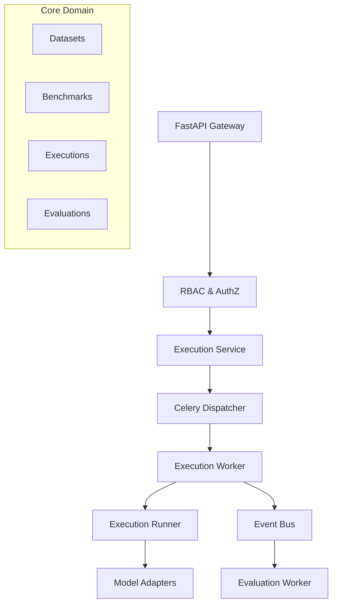

# Atlas Backend v1.0.0

Atlas is a distributed execution and evaluation platform for large language models. It provides a structured, API-first approach to defining datasets, composing benchmarks, executing AI models against those benchmarks, and evaluating their responses.

## License

Copyright (c) 2026. All rights reserved.

## Architecture

The Atlas backend follows a clean, modular architecture separating the domain model from asynchronous orchestration. 



## Technology Stack

- **Framework**: FastAPI (Python 3.10+)
- **Database**: SQLite (via SQLAlchemy 2.0)
- **Migrations**: Alembic
- **Task Queue**: Celery with Redis broker
- **Observability**: Structlog (structured JSON logging + ContextVar Correlation IDs)
- **Testing**: Pytest

## Core Features

- **Multi-Tenant Organizations & Projects**: Full RBAC isolation for resources.
- **Immutable Versioning**: Datasets and Benchmarks are immutably versioned for reproducibility.
- **Distributed Execution Engine**: Background task processing via Celery for running large-scale evaluations.
- **Event-Driven Evaluation**: Asynchronous evaluation dispatch decoupled from core execution.
- **Progress Tracking**: Real-time progress updates with batched database writes.
- **Deep Observability**: Distributed tracing with `X-Correlation-ID` across API boundaries and background tasks.

## API Endpoints (Summary)

The backend provides a RESTful API mounted at `/api/v1`:

- `/auth/*`: Login and JWT generation.
- `/organizations/*`: Organization and membership management.
- `/projects/*`: Project lifecycle within organizations.
- `/datasets/*`: Authoring and versioning evaluation datasets.
- `/benchmarks/*`: Combining datasets into executable benchmarks.
- `/projects/{id}/executions/*`: Triggering and monitoring runs.
- `/system/celery/health`: Cluster health monitoring.

## Local Setup

The recommended way to run Atlas is using Docker. For full details on the container architecture, see the [Docker Setup Guide](docs/docker_setup.md).

### 1. Requirements
- Python 3.10+
- Redis Server (running on `localhost:6379`)

### 2. Installation
```bash
python -m venv .venv
source .venv/bin/activate  # On Windows: .venv\Scripts\activate
pip install -r requirements.txt
```

### 3. Database Setup
```bash
cd packages/database
python -m alembic upgrade head
```

### 4. Running the API
```bash
uvicorn apps.backend.main:app --reload --port 8000
```

### 5. Running the Celery Worker
```bash
# Ensure Redis is running
celery -A apps.backend.worker.celery_app worker --loglevel=INFO
```

### 6. Running Tests
```bash
python -m pytest tests/backend
```

## Release History

- **v1.0.0 (Current)**: Initial stable release. Implemented authentication, dataset/benchmark versioning, asynchronous execution orchestration, distributed evaluation, and operational observability.
