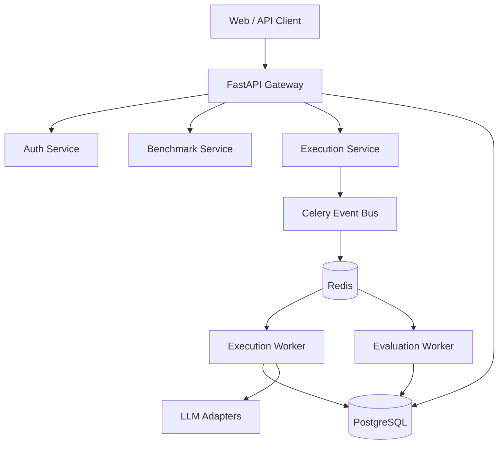

# Architecture State

## Architecture Diagram

## Service Dependency Graph
- **API** depends on -> PostgreSQL, Redis
- **Worker** depends on -> PostgreSQL, Redis
- **Scheduler** depends on -> Redis

## Database Dependency Graph
- `Alembic` manages schema over `PostgreSQL`. 
- Repositories (`packages/database/repositories`) abstract access for domain services.
- Data access is heavily injected into FastAPI routes via `Depends(get_db)`.

## Docker Dependency Graph
- `api` -> `db` (healthy), `redis` (healthy)
- `worker` -> `db` (healthy), `redis` (healthy)
- `scheduler` -> `db` (healthy), `redis` (healthy)

## Package Relationships
- `apps/backend` -> imports `services`, `packages`.
- `services/*` -> imports `packages/database`, `packages/llm`.
- `packages/*` -> independent foundational utilities.

## Flow Definitions
- **Execution flow**: Client -> API -> ExecutionService -> EventBus -> Worker -> Database.
- **Worker flow**: Worker -> Pull from Redis -> Execute LLM -> Write results to DB -> Emit Evaluation Event.
- **Build flow**: `uv` resolves `uv.lock` -> Docker Multi-stage build syncs `.venv` -> Copies source -> Image generated.
- **Runtime flow**: `docker-compose up` -> DB/Redis Start -> API/Worker Start -> Alembic Migration (API container) -> Uvicorn serves traffic.
- **Deployment flow**: Production compose overrides dev volume binds, enforcing locked, read-only application containers and aggressive restart policies.
