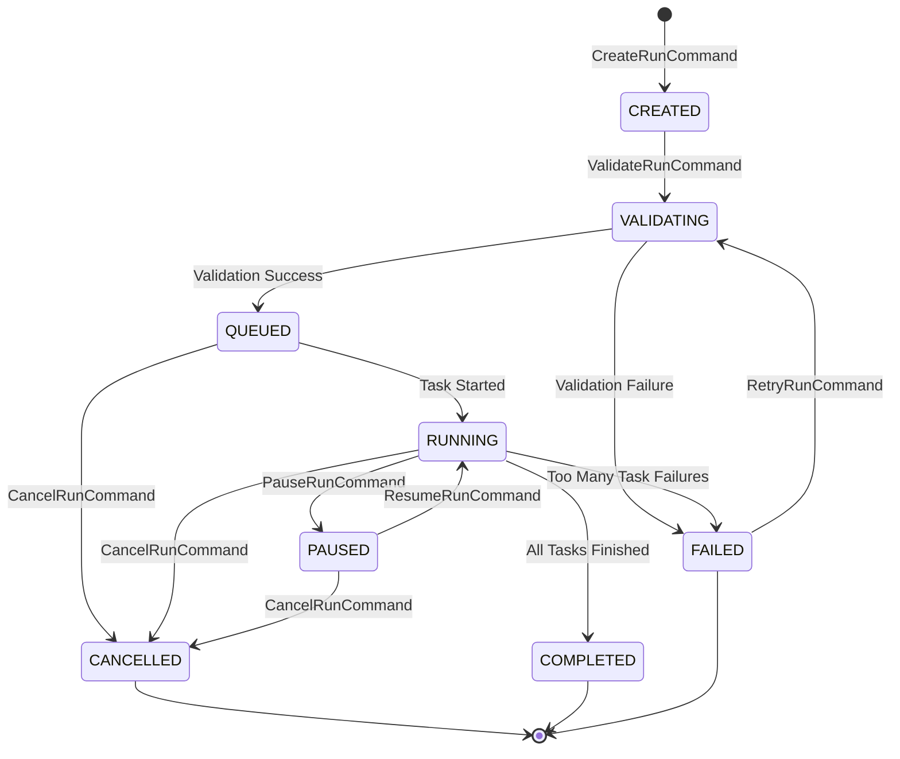
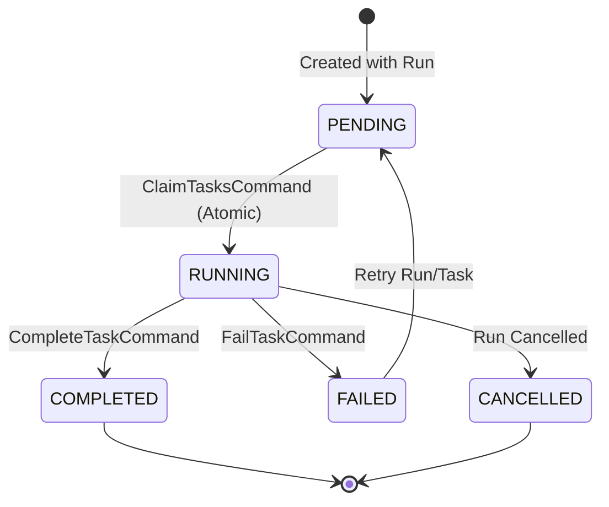
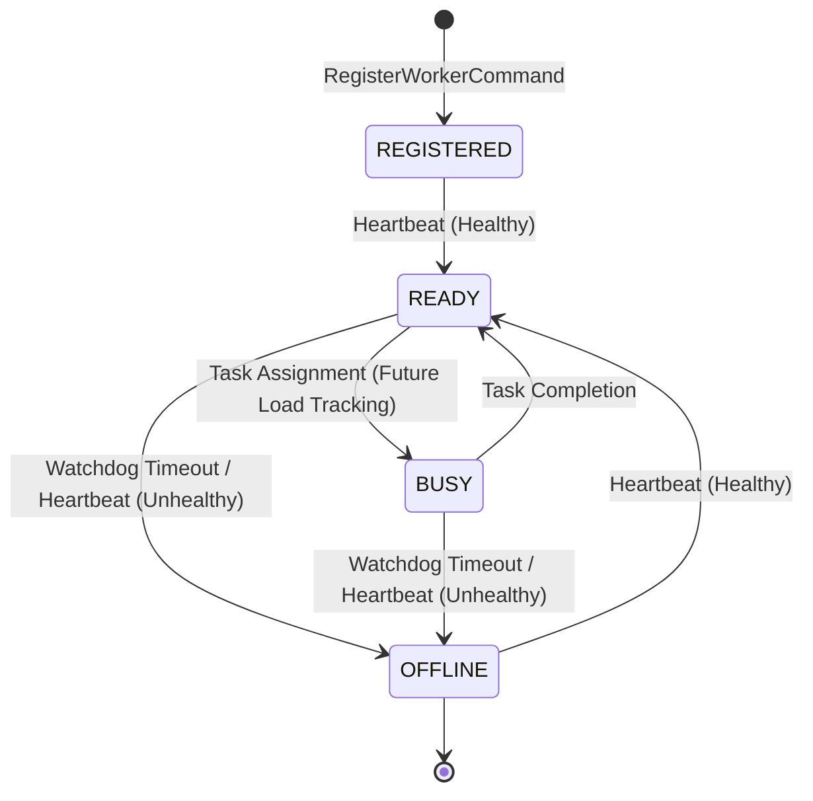

# State Machine Reference

This document maps the allowed state transitions for the core entities in the Execution Service. Any transition not documented here is strictly prohibited and should throw a `ValueError` or `IllegalStateTransitionError`.

## AtlasRun Lifecycle

## AtlasTask Lifecycle

## ExecutionWorker Lifecycle

