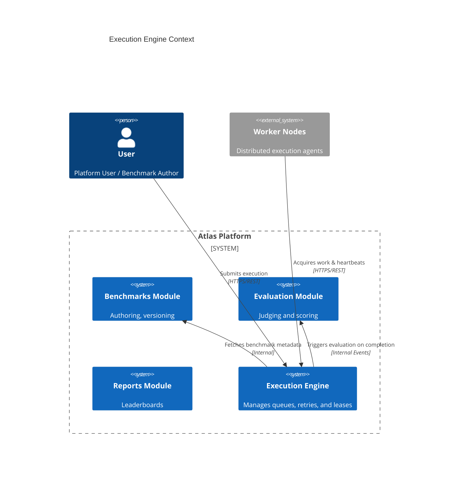
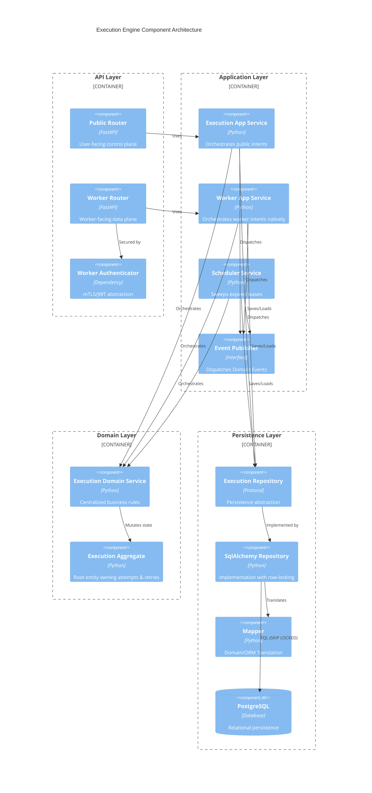
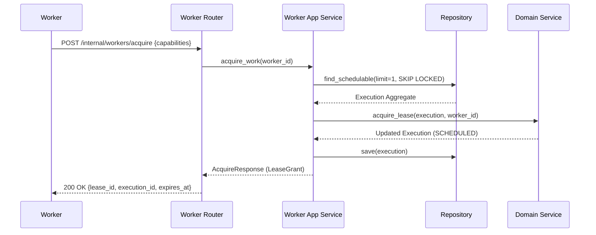
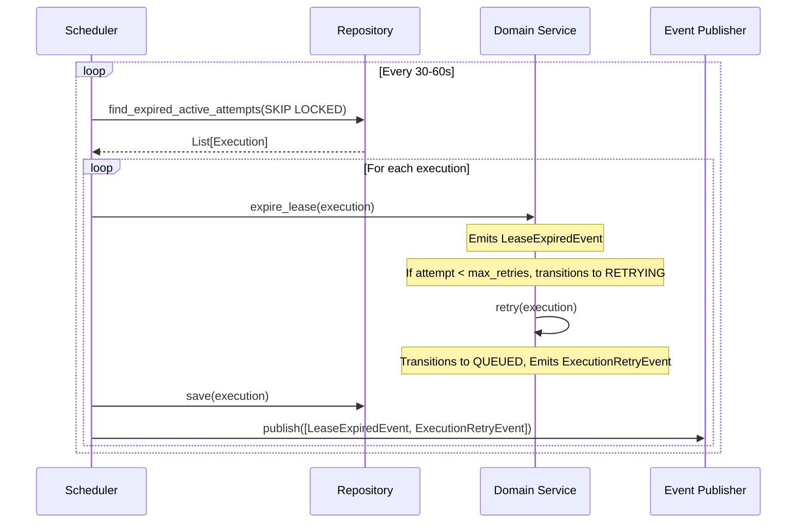

# Execution Engine: Architecture Baseline

This document serves as the canonical architectural baseline for the Atlas Benchmarking Platform's **Execution Engine** module (as of v1.1 Phase B completion). It describes the high-level design, bounded contexts, layer separation, aggregate boundaries, and operational semantics that govern benchmark execution.

## 1. Context Diagram

The Execution Engine operates as a distinct bounded context within Atlas, mediating between the Benchmark authoring domain and the distributed Worker network.

## 2. Component Diagram

The internal structure of the Execution Engine strictly separates the **Control Plane** (Public REST API) from the **Data Plane** (Internal Worker API). 

## 3. Sequence Diagrams

### 3.1 Worker Acquire (Data Plane)
Workers pull work using a strict protocol that avoids leaking domain aggregates.

### 3.2 Lease Sweeping (Scheduler)
The background sweeper finds expired leases, but relies entirely on the Domain to determine if a retry is allowed.

## 4. Aggregate Responsibilities
The `Execution` aggregate acts as the transactional and consistency boundary.
- **Owns Attempts**: Maintains the history of all `ExecutionAttempt`s.
- **Owns the Lease Lifecycle**: Enforces constraints around who holds a lease, preventing rogue heartbeats or completions from unauthorized workers.
- **Owns Retry Policy**: Decides whether a failed/expired attempt should result in a retry (transitioning to `QUEUED`) or a terminal failure (`FAILED`).

The **Scheduler does not own retry policy**. The **Worker does not own retry policy**.

## 5. Event Catalog
All state transitions within the `Execution` aggregate emit domain events. Events emitted by a single aggregate are guaranteed to preserve causal order.

| Event | Triggered When |
|-------|----------------|
| `ExecutionQueuedEvent` | An execution is first created or successfully retried. |
| `ExecutionStartedEvent` | A worker successfully acquires a lease. |
| `ExecutionHeartbeatEvent` | A worker extends its active lease. |
| `ExecutionCompletedEvent` | A worker successfully uploads artifacts and marks completion. |
| `ExecutionFailedEvent` | A worker reports failure, or a lease expires, and `max_retries` is exhausted. |
| `LeaseExpiredEvent` | The scheduler detects an elapsed lease. Always precedes a Retry or Failed event. |
| `ExecutionRetryEvent` | A lease expires or worker fails, but retries remain. |
| `ExecutionCancelledEvent` | A user intentionally cancels a non-terminal execution. |

## 6. Architectural Decision Records (ADRs)

### ADR-01: Control Plane vs Data Plane Separation
- **Context**: The REST APIs needed to serve both standard users submitting benchmarks and distributed workers picking them up.
- **Decision**: Split the APIs entirely (`/api/v1/executions` vs `/api/v1/internal/workers`).
- **Reasoning**: User operations and worker operations have completely different authentication models, authorization requirements, and intent semantics.
- **Outcome**: The Worker Router uses `AcquireResponse` DTOs, keeping internal aggregate structures safely out of the public and worker API boundaries.

### ADR-02: Domain Owns Retry Policy
- **Context**: When a lease expires or a worker crashes, the system must decide whether to retry.
- **Decision**: Centralize the retry decision (`max_retries` evaluation) inside the `ExecutionService`.
- **Reasoning**: If the scheduler owned the retry decision, business logic would leak into background orchestration infrastructure. By pushing it to the domain, the scheduler merely observes time ("This lease expired") and the domain reacts.

### ADR-03: Repository Returns Aggregate Roots Only
- **Context**: Complex ORM models (`ExecutionModel`, `AttemptModel`, `LeaseModel`) can lead to partial object manipulation.
- **Decision**: The Repository interface (`ExecutionRepository`) exclusively returns and saves the root `Execution` domain object.
- **Reasoning**: Enforces strict Consistency Boundaries. It is impossible to bypass the domain service to manually edit a lease in the database.

## 7. Non-Goals
To prevent scope creep, the Execution Engine is currently **NOT** responsible for:
- **Message Bus Infrastructure**: Event publication is an interface (`EventPublisher`). The system is completely agnostic to whether Kafka, RabbitMQ, or Redis streams are used natively.
- **Worker Orchestration**: It does not spin up Kubernetes Jobs or manage compute auto-scaling. It acts purely as a passive queue for autonomous workers.
- **Metrics/Monitoring Storage**: It emits events and exposes REST endpoints, but doesn't implement a Prometheus/Grafana stack natively.

## 8. Extension Points (Future Work)
- **Outbox Pattern**: Moving event publishing inside the database transaction (`Persist Aggregate + Persist Events -> Commit -> Outbox Dispatcher -> Message Bus`) for guaranteed reliable delivery.
- **Observability**: Adding Correlation IDs, structured logging (Worker ID / Lease ID), and latency tracking.
- **Exponential Backoff**: Adding a `visible_after` timestamp to allow delayed retries.
- **Optimistic Concurrency**: Introducing version columns (`_version`) for non-scheduler updates to augment the existing pessimistic (`FOR UPDATE SKIP LOCKED`) locks.
