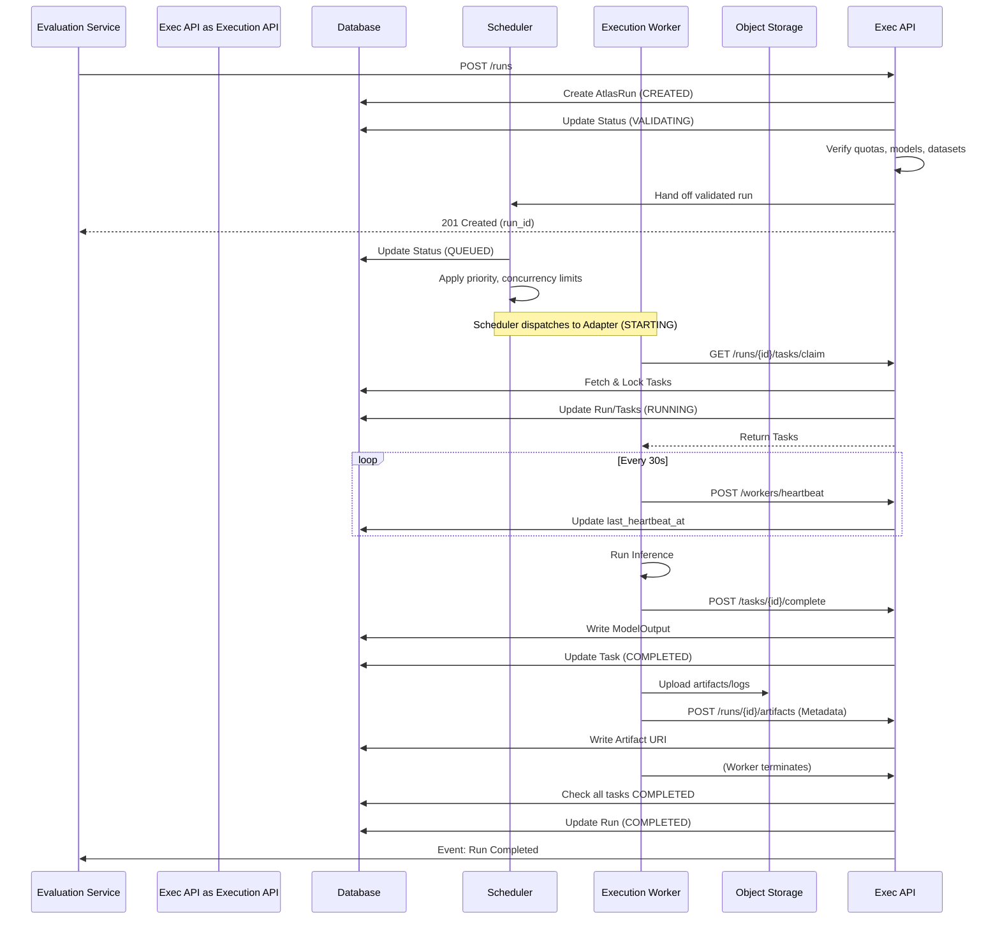
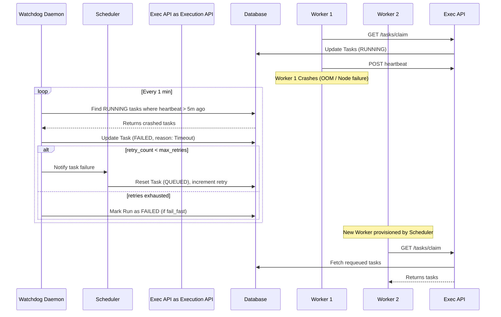
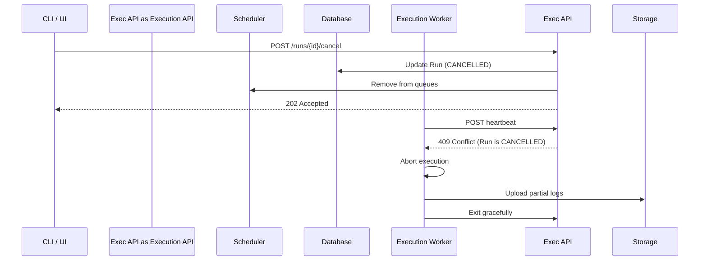

# Execution Sequence Diagrams

## 1. Happy Path: Run Execution with Scheduler

```mermaid
sequenceDiagram
    participant Eval as Evaluation Service
    participant Exec API as Execution API
    participant DB as Database
    participant Sched as Scheduler
    participant Worker as Execution Worker
    participant Storage as Object Storage

    Eval->>Exec API: POST /runs
    Exec API->>DB: Create AtlasRun (CREATED)
    
    Exec API->>DB: Update Status (VALIDATING)
    Exec API->>Exec API: Verify quotas, models, datasets
    
    Exec API->>Sched: Hand off validated run
    Exec API-->>Eval: 201 Created (run_id)
    
    Sched->>DB: Update Status (QUEUED)
    Sched->>Sched: Apply priority, concurrency limits
    
    note over Sched,Worker: Scheduler dispatches to Adapter (STARTING)
    Worker->>Exec API: GET /runs/{id}/tasks/claim
    Exec API->>DB: Fetch & Lock Tasks
    Exec API->>DB: Update Run/Tasks (RUNNING)
    Exec API-->>Worker: Return Tasks
    
    loop Every 30s
        Worker->>Exec API: POST /workers/heartbeat
        Exec API->>DB: Update last_heartbeat_at
    end
    
    Worker->>Worker: Run Inference
    
    Worker->>Exec API: POST /tasks/{id}/complete
    Exec API->>DB: Write ModelOutput
    Exec API->>DB: Update Task (COMPLETED)
    
    Worker->>Storage: Upload artifacts/logs
    Worker->>Exec API: POST /runs/{id}/artifacts (Metadata)
    Exec API->>DB: Write Artifact URI
    
    Worker->>Exec API: (Worker terminates)
    Exec API->>DB: Check all tasks COMPLETED
    Exec API->>DB: Update Run (COMPLETED)
    
    Exec API->>Eval: Event: Run Completed
```

## 2. Worker Crash & Recovery

```mermaid
sequenceDiagram
    participant Daemon as Watchdog Daemon
    participant Sched as Scheduler
    participant Exec API as Execution API
    participant DB as Database
    participant W1 as Worker 1
    participant W2 as Worker 2

    W1->>Exec API: GET /tasks/claim
    Exec API->>DB: Update Tasks (RUNNING)
    W1->>Exec API: POST heartbeat
    
    note over W1: Worker 1 Crashes (OOM / Node failure)
    
    loop Every 1 min
        Daemon->>DB: Find RUNNING tasks where heartbeat > 5m ago
        DB-->>Daemon: Returns crashed tasks
        Daemon->>DB: Update Task (FAILED, reason: Timeout)
        
        alt retry_count < max_retries
            Daemon->>Sched: Notify task failure
            Sched->>DB: Reset Task (QUEUED), increment retry
        else retries exhausted
            Daemon->>DB: Mark Run as FAILED (if fail_fast)
        end
    end
    
    note over W2: New Worker provisioned by Scheduler
    W2->>Exec API: GET /tasks/claim
    Exec API->>DB: Fetch requeued tasks
    Exec API-->>W2: Returns tasks
```

## 3. User Cancellation

```mermaid
sequenceDiagram
    participant User as CLI / UI
    participant Exec API as Execution API
    participant Sched as Scheduler
    participant DB as Database
    participant Worker as Execution Worker

    User->>Exec API: POST /runs/{id}/cancel
    Exec API->>DB: Update Run (CANCELLED)
    Exec API->>Sched: Remove from queues
    Exec API-->>User: 202 Accepted
    
    Worker->>Exec API: POST heartbeat
    Exec API-->>Worker: 409 Conflict (Run is CANCELLED)
    
    Worker->>Worker: Abort execution
    Worker->>Storage: Upload partial logs
    Worker->>Exec API: Exit gracefully
```
