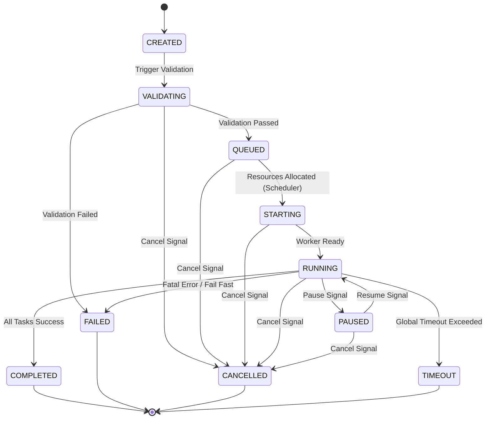
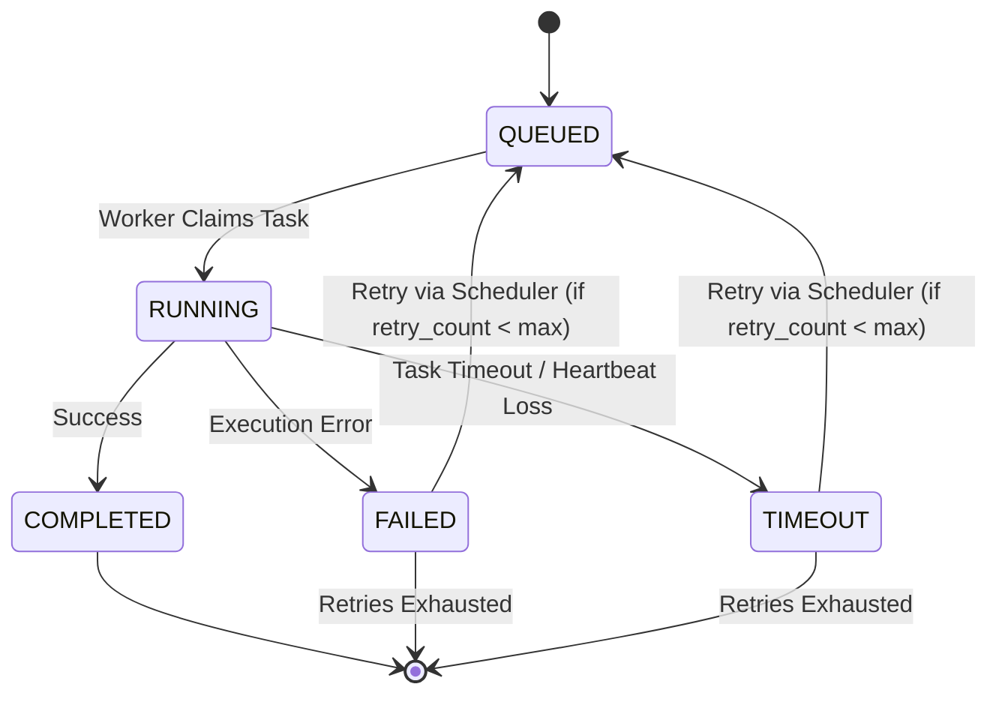

# Execution State Machine

The Execution Service manages state across two primary entities: `AtlasRun` (the global execution batch) and `AtlasTask` (the individual sub-tasks, typically mapping to test cases).

## AtlasRun State Machine

A Run can be in one of the following states:

- **CREATED:** The run has been initialized in the database but is not yet validated.
- **VALIDATING:** Verifying that the benchmark, adapter, model, dataset, and configuration exist and that the user has the necessary permissions and quota.
- **QUEUED:** Validated and waiting in the dispatch queue (managed by the Scheduler) for resources to become available.
- **STARTING:** The adapter is allocating resources (e.g., spinning up pods, downloading images).
- **RUNNING:** Active task execution is underway. At least one task is being processed.
- **PAUSED:** The run has been paused (either manually by the user, or automatically due to rate limits/budget).
- **COMPLETED:** All tasks finished successfully. (Terminal)
- **FAILED:** The run encountered a fatal error, validation failed, or tasks failed and retries were exhausted. (Terminal)
- **CANCELLED:** The run was aborted by a user or system command. (Terminal)
- **TIMEOUT:** The run exceeded its global maximum execution time. (Terminal)

### Run Transitions

## AtlasTask State Machine

A Task (mapping to a specific test case evaluation) has a narrower state machine:

- **QUEUED:** Waiting to be claimed by a worker.
- **RUNNING:** Claimed by a worker, inference in progress.
- **COMPLETED:** Result successfully generated. (Terminal)
- **FAILED:** Task failed (Terminal if max_retries reached).
- **TIMEOUT:** Task exceeded its individual timeout. (Terminal)

### Task Transitions

