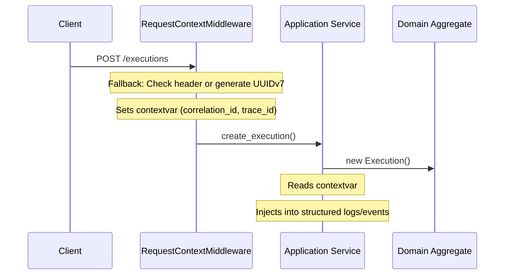
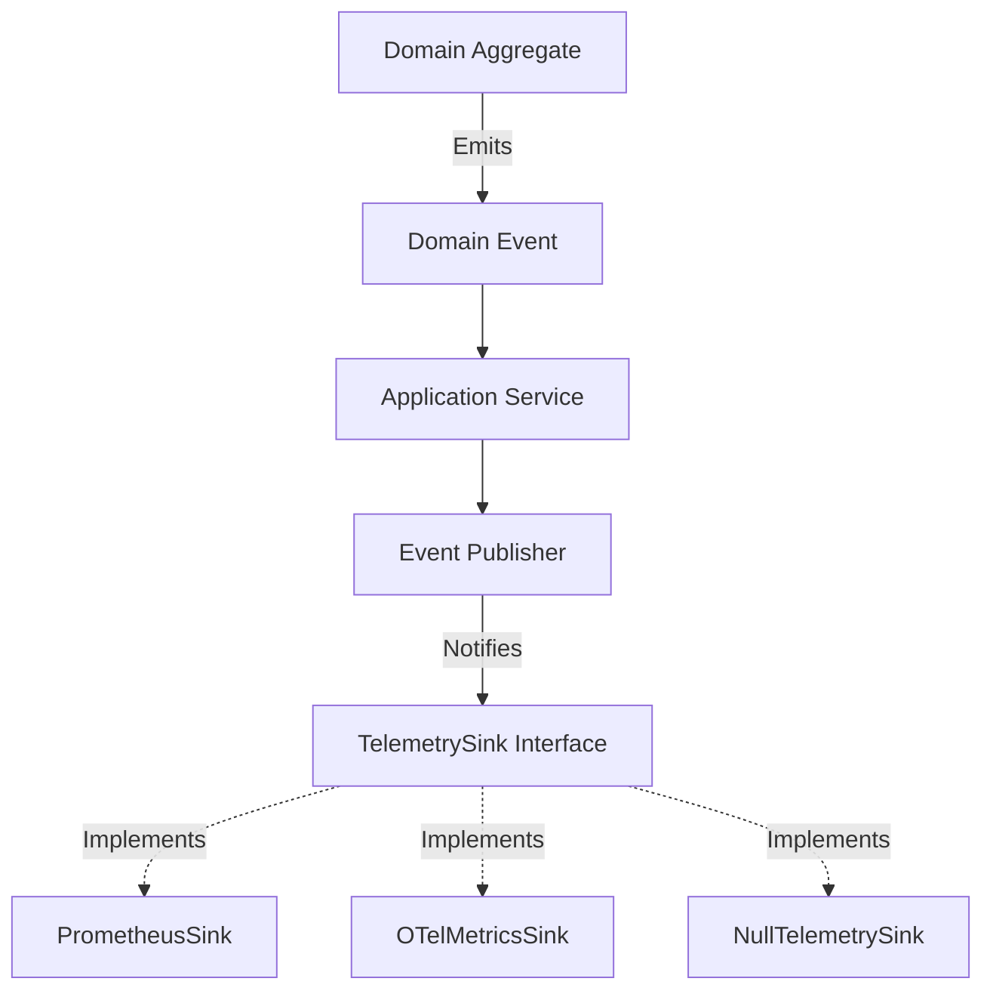

# Observability Architecture Overview

This document describes how the observability layer is architected and integrated into the Atlas backend.

## Design Philosophy
Observability is treated as a cross-cutting concern. It must not leak into the Domain Layer. The Domain is pure; it returns data or emits events. The Observability layer observes those events and translates them into logs, metrics, and traces.

## 1. Context Propagation
To achieve end-to-end correlation, we use `contextvars` to pass context across asynchronous execution boundaries without explicitly passing it down the call stack.

## 2. Structured Logging Infrastructure
We utilize `structlog` to enforce structured JSON logging across the application.
- **Processors**: A chain of processors automatically injects the `timestamp`, `correlation_id`, `trace_id`, `span_id`, `category`, and `level`.
- **Renderers**: In development, logs are rendered nicely in the console. In production, logs are strictly rendered as JSON for ingestion by centralized logging platforms (e.g., ELK, Datadog).
- **Redaction**: A global redaction processor ensures sensitive keys (passwords, tokens) are filtered before emitting.
- **Sampling**: DEBUG logs are configured with a sampling processor to restrict sheer volume in production environments.

## 3. Metrics Abstraction (Vendor-Neutral)
Metrics are strictly separated from business logic. Instead of calling `metrics.increment()` inside the Domain, we use the Application Layer or Event Publisher to translate Domain Events into telemetry.

To prevent vendor lock-in with Prometheus, the Event Publisher routes data through a `TelemetrySink` abstraction:

## 4. Tracing Hooks
While full OpenTelemetry tracing is slated for future expansion, the architectural hooks are placed at the boundaries:
- **Router Boundary**: Middleware intercepts requests to start/stop the root span, populating `span_id` and measuring total request duration.
- **Database Boundary**: SQLAlchemy `before_cursor_execute` and `after_cursor_execute` events are hooked to record query durations and execution counts, avoiding pollution of the Repository implementations.

## 5. Health and Diagnostic Endpoints
The backend exposes dedicated endpoints for infrastructure scraping:
- `/health/live`: Liveness probe (Is the process running?)
- `/health/ready`: Readiness probe (Are the database and storage connected?)
- `/metrics`: Exposes the telemetry sink's aggregated data.
