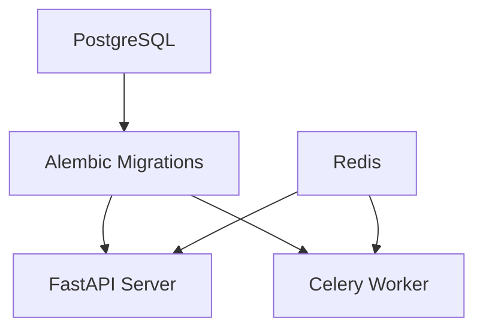

# Docker Readiness & Architectural Audit Report

## 1. Project Overview
- **Purpose**: Atlas is a distributed execution and evaluation platform for large language models. It provides a structured, API-first approach to defining datasets, composing benchmarks, and executing AI models.
- **Main problem it solves**: Orchestrating complex LLM evaluation workflows synchronously and asynchronously with full observability and immutable versioning.
- **Overall architecture**: Modular architecture separating the domain model from asynchronous orchestration. It consists of a FastAPI API Gateway, domain services, and Celery-based background workers.
- **Technology stack**: Python 3.11+, FastAPI, SQLAlchemy 2.0, Alembic, PostgreSQL, Celery, Redis. Dependency management via `uv` / `pip`.
- **Design philosophy**: Clean, modular, event-driven. Unidirectional dependencies (e.g., Evaluation depends on Execution, not vice versa) and isolated state machines.

## 2. Repository Structure
- `apps/`: Contains the entry points for applications.
  - `apps/backend/`: The FastAPI core API, containing routers, config, and Celery app initialization.
  - `apps/web/`: A Next.js frontend (currently uninitialized/stub).
  - `apps/admin/`: An admin application stub.
- `packages/`: Reusable, core foundational libraries.
  - `packages/database/`: SQLAlchemy models, Alembic migrations, and the repository pattern layer.
- `services/`: Business logic modularized by domain (e.g., `auth`, `benchmark`, `dataset`, `evaluation`, `execution`).
- `docs/`: Architectural Decision Records (ADRs) and documentation.
- `tests/`: Project-wide tests suite.

## 3. Backend Architecture
- **Entry points**: `apps/backend/main.py` starts the FastAPI server. `apps/backend/worker/celery_app.py` starts the Celery workers.
- **Services**: Domain logic is encapsulated in the `services/` directory, accessed via the API routers.
- **Packages**: `packages/database` provides the data access layer (Repository pattern).
- **Database layer**: SQLAlchemy 2.0 ORM.
- **APIs**: RESTful API mounted at `/api/v1`.
- **Configuration**: Managed via `pydantic-settings` in `apps.backend.config.Settings`.
- **Dependency Injection**: Used heavily via FastAPI's `Depends` (e.g., database sessions).
- **Event system**: `ExecutionEventBus` interfaces, specifically `CeleryExecutionEventBus`, push domain events into the async task queue.
- **Worker architecture**: Celery workers (`ExecutionWorker`) pull tasks from Redis to run benchmarks and evaluations.

## 4. Database
- **Technologies**: PostgreSQL (preferred for production) / SQLite (currently default in `config.py`).
- **ORM**: SQLAlchemy 2.0.
- **Migrations**: Alembic (`packages/database/alembic/`).
- **Docker Needs**: A persistent PostgreSQL container, initialization scripts (if any), and ensuring Alembic migrations run on startup or via a CI/CD job before the API starts.

## 5. External Dependencies
- **PostgreSQL**: 
  - Required? Yes (Core relational database).
  - Local/Prod? Both.
- **Redis**: 
  - Required? Yes (Celery message broker and Result Backend; caching).
  - Local/Prod? Both.
- **RabbitMQ / Kafka**: Not used natively; Celery uses Redis as the broker.
- **MinIO / Object Storage**: Not currently implemented or required by the existing configs.
- **Vector databases / Search**: Not currently implemented.
- **Monitoring / Logging**: Structlog is used for structured logging. No external APM agent is strictly required for startup, but logs are output to stdout.

## 6. Runtime Requirements
- **Environment variables**: `DATABASE_URL`, `CELERY_BROKER_URL`, `CELERY_RESULT_BACKEND`, `JWT_SECRET`, `ENVIRONMENT`.
- **Ports**: API requires `8000`. DB is `5432`. Redis is `6379`.
- **Volumes**: PostgreSQL data volume, Redis data volume.
- **Startup order**: 
  1. PostgreSQL & Redis
  2. Database Migrations (Alembic)
  3. FastAPI Server & Celery Worker

## 7. Build System
- **Package management**: The project uses a `pyproject.toml` configured with `setuptools`, but also contains a `uv.lock` and `requirements.txt`. It appears to use standard `pip` or `uv` for dependency resolution.
- **Build process**: Standard Python package installation. 
- **Testing**: `pytest` run via `python -m pytest`.

## 8. Docker Readiness Assessment
**Score**: 3/10
- **Missing files**: No `Dockerfile`, no `.dockerignore`.
- **Configs**: `docker-compose.yml` exists but only provisions a single `postgres` container without Redis, API, or Worker definitions.
- **Build issues**: None expected, but dependencies need to be cached effectively.
- **Hardcoded paths**: `config.py` defaults to `sqlite:///./atlas.db` and `redis://localhost:6379/0`. These need to be overridden via environment variables in Docker.

## 9. Dockerization Strategy
**Recommendation**: Multi-stage `Dockerfile` with `docker-compose.yml`.
- **Single Dockerfile**: We can use a single multi-stage `Dockerfile` for the backend that builds the Python environment. Both the FastAPI container and the Celery worker container can use this exact same image, just overriding the `command`.
- **docker-compose.yml**: For local development, grouping PostgreSQL, Redis, the API, and the Celery Worker into a single cohesive network.
- **Volumes**: Named volumes for DB and Redis to ensure data persistence across container restarts.

## 10. Service Dependency Graph

*Health checks on Postgres and Redis are necessary before the API and Workers attempt to start.*

## 11. Risks
- **SQLite Fallback**: If `DATABASE_URL` is not injected properly, the app silently falls back to SQLite, which will cause data consistency issues across multiple containers (API vs. Worker).
- **Migration Timing**: If the API or Worker starts before Alembic has run, it may crash or behave unpredictably.
- **Secrets Management**: `JWT_SECRET` must not be baked into the image.

## 12. Implementation Plan

### Phase 1: Base Configuration
- Create a comprehensive `.dockerignore`.
- Create a multi-stage `Dockerfile` optimizing for layer caching (installing dependencies before copying source code).

### Phase 2: Local Development Setup
- Expand `docker-compose.yml` to include:
  - `postgres` (with healthcheck and volume)
  - `redis` (with healthcheck and volume)
  - `api` (FastAPI mapped to port 8000, depending on db and redis)
  - `worker` (Celery worker, depending on db and redis)

### Phase 3: Environment & Configuration
- Create `.env.example` mapping out `DATABASE_URL` (pointing to the `postgres` container) and `CELERY_BROKER_URL` (pointing to the `redis` container).

### Phase 4: Production Considerations (Optional)
- Create `docker-compose.prod.yml` if necessary (e.g., removing volume bindings for local code, adding restart policies).

### Phase 5: Documentation
- Update `README.md` (or a dedicated `docs/docker_setup.md`) with instructions on how to start the environment using `docker-compose up`.
