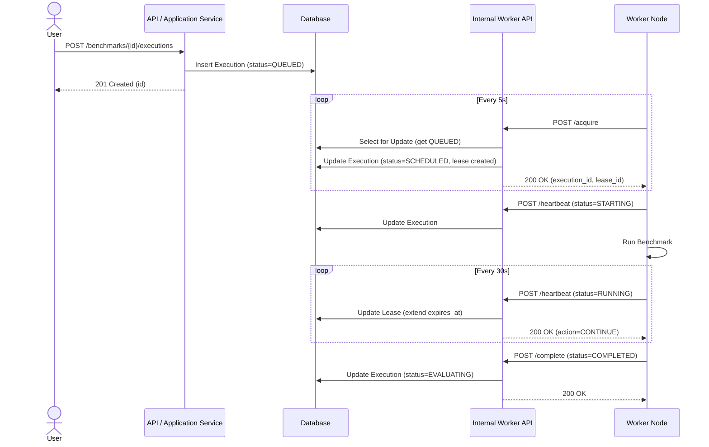
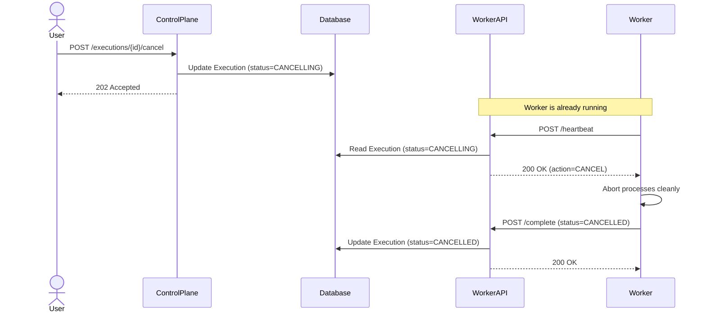
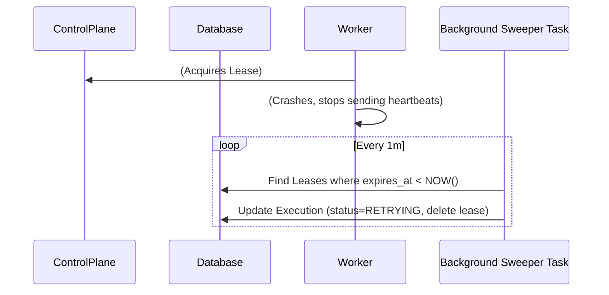

# Execution Sequence Diagrams

These sequence diagrams illustrate the distributed interactions between the User, the Control Plane (Public API), the Data Plane (Worker API / Service), and the external Worker Nodes.

## 1. Happy Path: Queue to Completion

## 2. Cancellation Flow

## 3. Worker Crash (Orphaned Lease)

