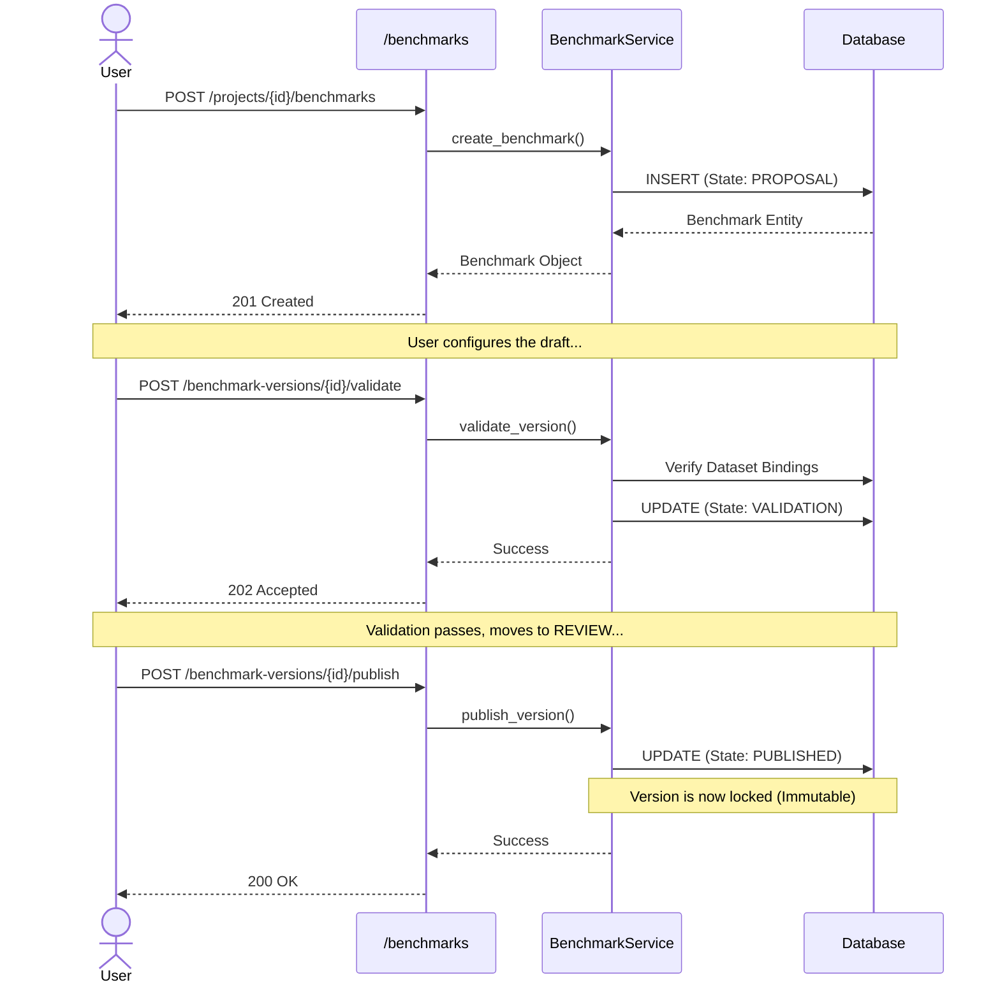
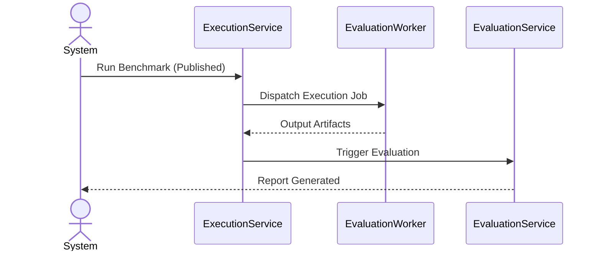

# Phase A Architecture Design

This document details the backend architectural boundaries, implementation rules, and interactions for Phase A (Benchmark Authoring).

## 1. Architectural Principles

These engineering guardrails apply to all Atlas backend code:
- **Routers contain no business logic**: They only handle HTTP serialization, parameter extraction, and authorization scoping.
- **Services implement domain behavior**: All business rules (e.g., state transitions, validation) reside here.
- **Repositories are responsible only for persistence**: They translate domain objects to/from the database.
- **Domain validation lives in the service layer**: Not in the database or the router.
- **Published entities are immutable**: Enforced strictly at the service layer.
- **Version creation is explicit**: Never implicit. Users must call the versioning API.
- **All state transitions are validated through the lifecycle contract**: Transitions bypass validation.
- **API contracts are backward compatible** within a major version.
- **Cross-boundary read endpoints compose data manually**: Timeline endpoints intentionally resolve related benchmark metadata through explicit query composition instead of ORM relationships because execution persistence and atlas persistence maintain separate mapping boundaries.

## 2. Aggregate Roots & Ownership Boundaries

To maintain consistency, we enforce strict ownership hierarchies. A child entity's lifecycle is bound to its Aggregate Root. Cross-aggregate relationships are strictly references. 

```text
Organization
└── owns Projects

Project
└── owns Benchmarks

Benchmark
└── owns Benchmark Versions

Benchmark Version
├── owns Dataset Bindings
├── owns Evaluation Configuration
└── owns Metrics

Execution
└── owns Evaluation Results

Evaluation
└── owns Reports
```

**Example Rule**: A Dataset does not own a Benchmark. A Benchmark references a Dataset Version.

## 3. Component Design

- **New Routers**: `apps/backend/routers/benchmarks.py`
- **New Services**: `packages/database/atlas_db/services/benchmark_service.py`
- **Database Models**: Reuses `Benchmark`, `BenchmarkCategory`, `Capability`, `BenchmarkLifecycle`, `BenchmarkVersion` from `packages/database/atlas_db/models/authoring.py`.

## 4. Sequence Diagrams

### Benchmark Creation & Publishing



### Execution (Future Phase Preview)


