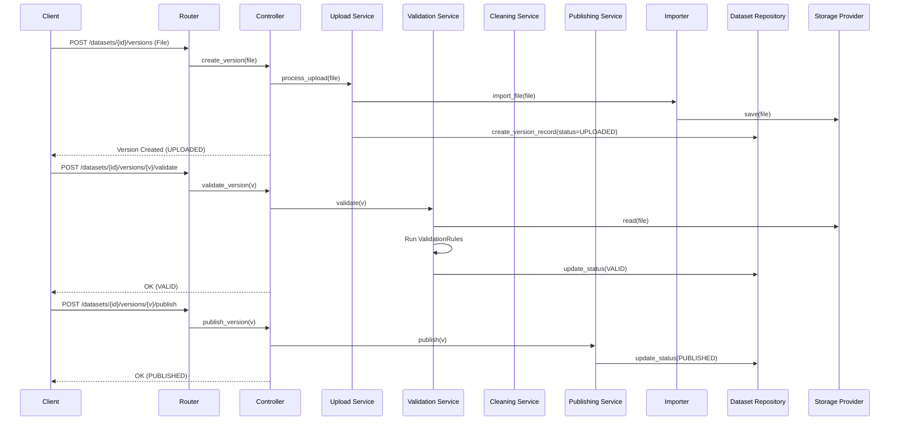

# Dataset Dataflow

```mermaid
sequenceDiagram
    participant Client
    participant Router
    participant Controller
    participant UploadSvc as Upload Service
    participant ValidationSvc as Validation Service
    participant CleanSvc as Cleaning Service
    participant PublishSvc as Publishing Service
    participant Importer
    participant Repo as Dataset Repository
    participant Storage as Storage Provider

    Client->>Router: POST /datasets/{id}/versions (File)
    Router->>Controller: create_version(file)
    Controller->>UploadSvc: process_upload(file)
    UploadSvc->>Importer: import_file(file)
    Importer->>Storage: save(file)
    UploadSvc->>Repo: create_version_record(status=UPLOADED)
    Controller-->>Client: Version Created (UPLOADED)

    Client->>Router: POST /datasets/{id}/versions/{v}/validate
    Router->>Controller: validate_version(v)
    Controller->>ValidationSvc: validate(v)
    ValidationSvc->>Storage: read(file)
    ValidationSvc->>ValidationSvc: Run ValidationRules
    ValidationSvc->>Repo: update_status(VALID)
    Controller-->>Client: OK (VALID)

    Client->>Router: POST /datasets/{id}/versions/{v}/publish
    Router->>Controller: publish_version(v)
    Controller->>PublishSvc: publish(v)
    PublishSvc->>Repo: update_status(PUBLISHED)
    Controller-->>Client: OK (PUBLISHED)
```
