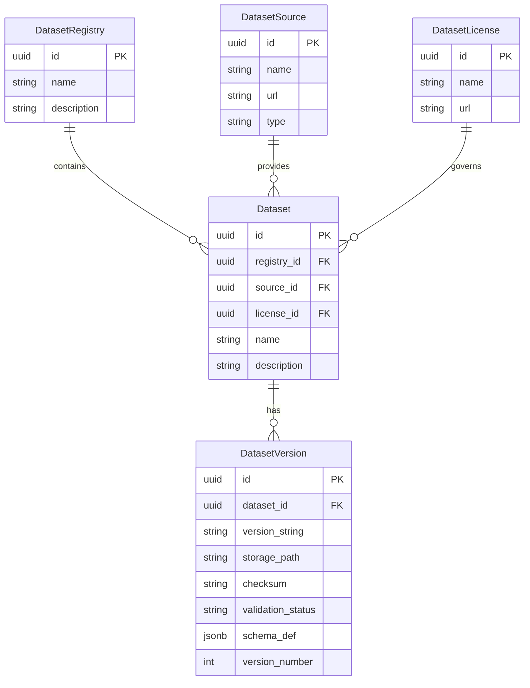

# Dataset ERD

```mermaid
erDiagram
    DatasetRegistry ||--o{ Dataset : contains
    DatasetSource ||--o{ Dataset : provides
    DatasetLicense ||--o{ Dataset : governs
    
    Dataset ||--o{ DatasetVersion : has
    
    DatasetRegistry {
        uuid id PK
        string name
        string description
    }
    
    DatasetSource {
        uuid id PK
        string name
        string url
        string type
    }
    
    DatasetLicense {
        uuid id PK
        string name
        string url
    }
    
    Dataset {
        uuid id PK
        uuid registry_id FK
        uuid source_id FK
        uuid license_id FK
        string name
        string description
    }
    
    DatasetVersion {
        uuid id PK
        uuid dataset_id FK
        string version_string
        string storage_path
        string checksum
        string validation_status
        jsonb schema_def
        int version_number
    }
```
