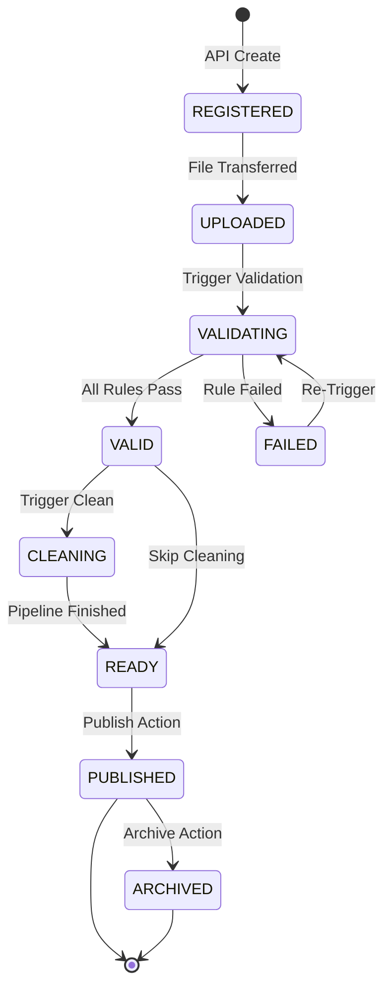

# Dataset State Machine

Dataset versions progress through a strict lifecycle to ensure data integrity before it reaches execution pipelines.

## State Definitions

- **REGISTERED**: Database entry exists, but no file is attached.
- **UPLOADED**: File is stored via `StorageProvider`, but contents are unverified.
- **VALIDATING**: `ValidationService` is actively running `ValidationRules`.
- **VALID**: Dataset file conforms to the required schema and checksums.
- **FAILED**: Validation failed. Fixes required before progression.
- **CLEANING**: `CleaningPipeline` is actively normalizing data.
- **READY**: Dataset is verified (and optionally cleaned) and is awaiting final approval.
- **PUBLISHED**: The dataset version is immutable and available for consumption by Authoring/Execution.
- **ARCHIVED**: The dataset version is deprecated and no longer available for new executions.
