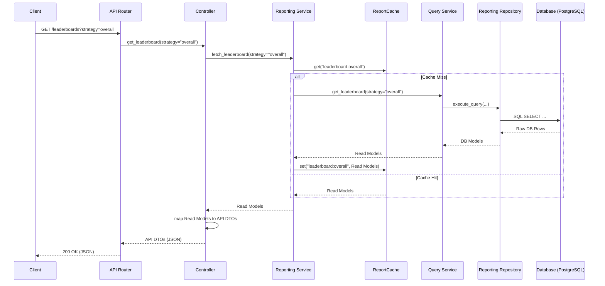

# Reporting Dataflow

## Key Flows
1. **API to Controller:** Input validation (via Pydantic DTOs).
2. **Controller to Service:** Business operation request.
3. **Service to Cache:** Check for cached Read Models.
4. **Service to Query Service:** If cache miss, delegate to the specific query service.
5. **Query Service to Repo:** Formulate data request based on domain logic.
6. **Repo to DB:** SQLAlchemy execution.
7. **Return Path:** DB Models are mapped to Read Models by the Query Service. Read Models are cached by the Service, then mapped to API DTOs by the Controller.
