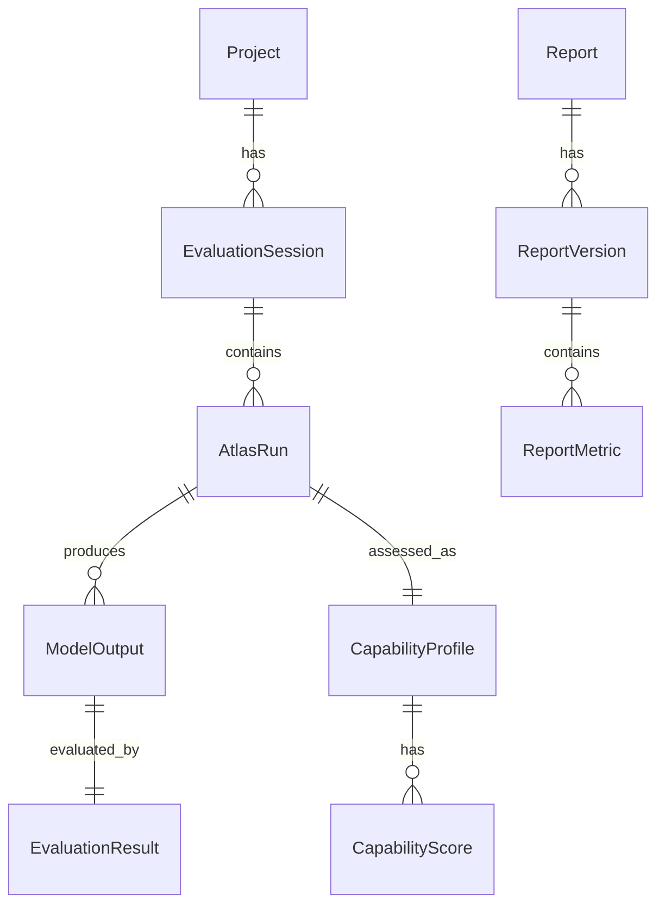
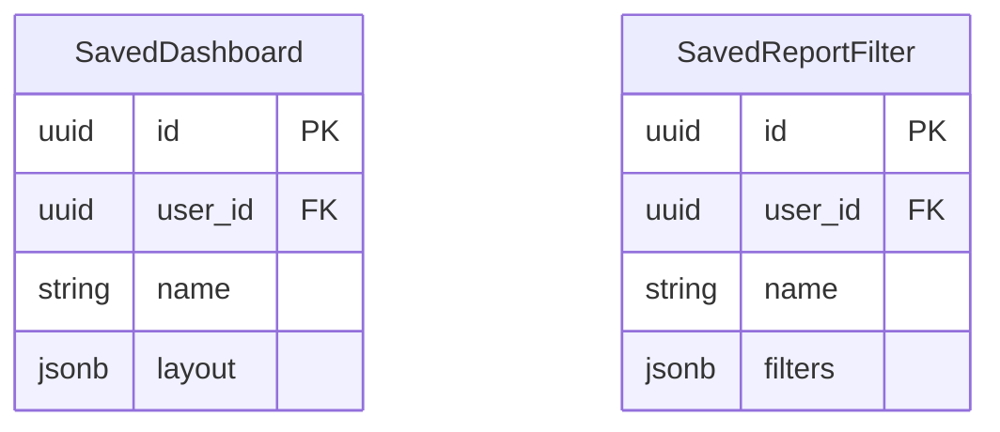

# Reporting ERD (Read-Only Context)

The Reporting Service primarily reads from the existing Atlas Database Schema. It defines minimal, if any, persistence of its own.

## External Dependencies (Read-Only)

## Internal Persistence (Future/If Needed)

If the Reporting Service eventually requires its own persistence (e.g., saving user-configured views), it would be strictly limited to:

*Note: These internal tables are not implemented in the V1 read-only aggregation engine, as per the invariant "Reporting owns no state."*
